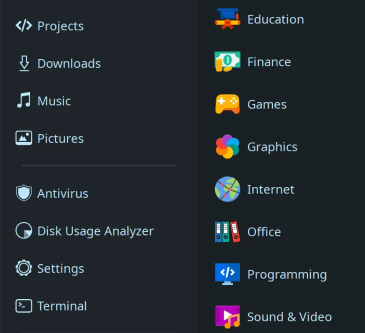

Binh-Icon

Đây là bộ icon và cursor màu mè tổng hợp theo sở thích cá nhân cho Linux GNOME, mình sử dụng cho mục đích cá nhân, nhưng chia sẻ cho bạn nào cùng ý thích. Bộ này ít chứa các icon tự vẽ (hình như vẫn có một số) mà chủ yếu được tổng hợp sử dụng lại từ các nguồn sau:

- [Papirus](https://github.com/PapirusDevelopmentTeam/papirus-icon-theme)
- [Yaru Deepblue](https://github.com/Jannomag/Yaru-Colors/tree/master/Icons/Yaru-Deepblue)
- [Adwaita Icon Theme](https://github.com/GNOME/adwaita-icon-theme)
- [https://www.svgrepo.com](https://www.svgrepo.com)
- Cursor: [Bibata Modern Ice](https://github.com/ful1e5/Bibata_Cursor)
- Một số nguồn icon khác

## Screenshot



## Yêu cầu

Chỉ tương thích Linux GNOME

## Cài đặt

Tải về và giải nén vào thư mục ~/.local/share/icons. Nếu thư mục chưa tồn tại, hãy tạo nó bằng lệnh Terminal hoặc giao diện.

Tuy nhiên, để cursor hoạt động tốt nhất, bạn nên chép vào thư mục /usr/share/icons bằng lệnh sau:

```bash
sudo cp -r <thư-mục-đã-giải-nén> /usr/share/icons

```
Sau đó chạy lệnh:
```bash
gtk-update-icon-cache -f -t <icon-path> # ví dụ: gtk-update-icon-cache -f -t /usr/share/icons/Binh-Icon
```
